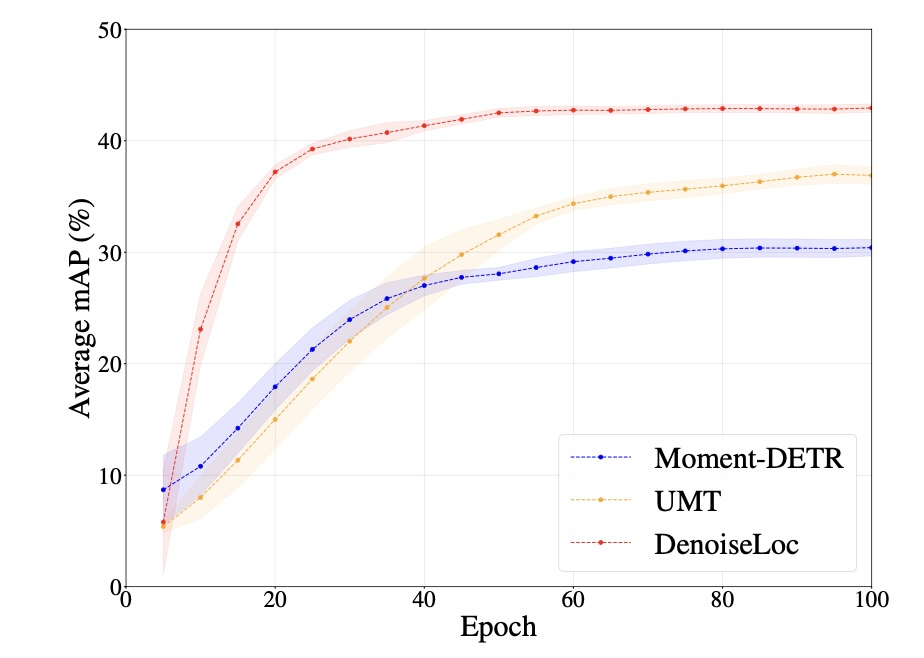

# DenoiseLoc

[DenoiseLoc: Boundary Denoising for Video Activity Localization](https://arxiv.org/abs/2304.02934), ICLR 2024

[Mengmeng Xu](https://mengmengxu.netlify.app/),
[Mattia Soldan](https://www.mattiasoldan.com/),
[Jialin Gao](https://scholar.google.com/citations?user=sj4FqEgAAAAJ&hl=zh-CN),
[Shuming Liu](https://scholar.google.ae/citations?user=gPcJ6YkAAAAJ&hl=en),
[Juan-Manuel Pérez-Rúa](https://scholar.google.com/citations?user=Vbvimu4AAAAJ&hl=es),
[Bernard Ghanem](https://www.bernardghanem.com/)

This repo hosts the original code of our DenoiseLoc work, along with a copy of the QVHighlights dataset for moment retrieval and highlight detections.
DenoiseLoc is an encoder-decoder model to tackle the video activity localization problem from a denoising perspective. During training, a set of action spans is randomly generated from the ground truth with a controlled noise scale. The inference reverses this process by boundary denoising, allowing the localizer to predict activities with precise boundaries and resulting in faster convergence speed. This code works for the QV-Highlights dataset, where we observe a gain of +12.36% average mAP over the baseline.

The code is developed on top of [Moment-DETR](https://github.com/jayleicn/moment_detr). We keep minimal changes for simplicity but make necessary adaptions for clarity. We keep the official data and evaluation tools in folders `data` and `standalone_eval`, respectively.

[](./teaser.jpg)


## Table of Contents

- [DenoiseLoc](#denoiseloc)
  - [Table of Contents](#table-of-contents)
  - [Prerequisites](#prerequisites)
  - [Training](#training)
  - [Inference](#inference)
  - [More](#more)
  - [Acknowledgement](#acknowledgement)
  - [LICENSE](#license)


## Prerequisites
0. Clone this repo

```
git clone https://github.com/frostinassiky/denoise_loc.git
cd moment_detr
```

1. Prepare feature files

Download feature file (8GB) `moment_detr_features.tar.gz`. The instruction can be found from [Moment-DETR](https://github.com/jayleicn/moment_detr). Then
extract it under the project root directory:
```
tar -xf path/to/moment_detr_features.tar.gz
```
The features are extracted using Linjie's [HERO_Video_Feature_Extractor](https://github.com/linjieli222/HERO_Video_Feature_Extractor).

If you have any issues with the feature file, please email us for alternative solutions.

2. Install dependencies.

This code requires Python 3.7, PyTorch, and a few other Python libraries.
We recommend creating a conda environment and installing all the dependencies as follows:
```
# create conda env
conda create --name denoise_loc python=3.7
# activate env
conda activate denoise_loc
# install pytorch with CUDA 11.6
conda install pytorch torchvision pytorch-cuda=11.6 -c pytorch -c nvidia
# install other python packages
pip install tqdm ipython easydict tensorboard tabulate scikit-learn pandas
# compile and install nms1d and align1d
cd lib/align1d
python setup.py install
cd ../nms1d
python setup.py install
```
The PyTorch version we tested is `1.9.0`.

## Training

Training can be launched by running the following batch script:
```
sbatch slurm/trainval_v100_snr.sh
```

Alternatively, you may revise the original training script and run it locally:
```
bash moment_detr/scripts/train.sh
```
For more configurable options, please check out the config file [moment_detr/config.py](moment_detr/config.py).

## Inference
Once the model is trained, you can use the following command for inference:
```
bash moment_detr/scripts/inference.sh CHECKPOINT_PATH SPLIT_NAME
```
where `CHECKPOINT_PATH` is the path to the saved checkpoint, `SPLIT_NAME` is the split name for inference, and can be one of `val` and `test`.

We provide the results in [Google Drive](https://drive.google.com/drive/folders/1SxVseo_uxZbt2zYeA_IkzU5F1i_qavQE?usp=drive_link)

## More
Since our project was developed from [Moment-DETR](https://github.com/jayleicn/moment_detr). Please refer to their codebase for:
1. Pretraining and Finetuning
2. Evaluation and Codalab Submission
3. Train Moment-DETR on your dataset
4. Run predictions on your videos and queries


## Acknowledgement
This code is based on [Moment-DETR](https://github.com/jayleicn/moment_detr), and the implementation is referred from [G-TAD](https://github.com/frostinassiky/gtad) and [DiffusionDet](https://github.com/ShoufaChen/DiffusionDet). We thank the authors for their awesome open-source contributions. We also thank @HSPUPIL for sharing the results and verifying the reproducibility.

## LICENSE
The annotation files are under [CC BY-NC-SA 4.0](https://creativecommons.org/licenses/by-nc-sa/4.0/) license, see [./data/LICENSE](data/LICENSE). All the code are under [MIT](https://opensource.org/licenses/MIT) license; see [LICENSE](./LICENSE).
